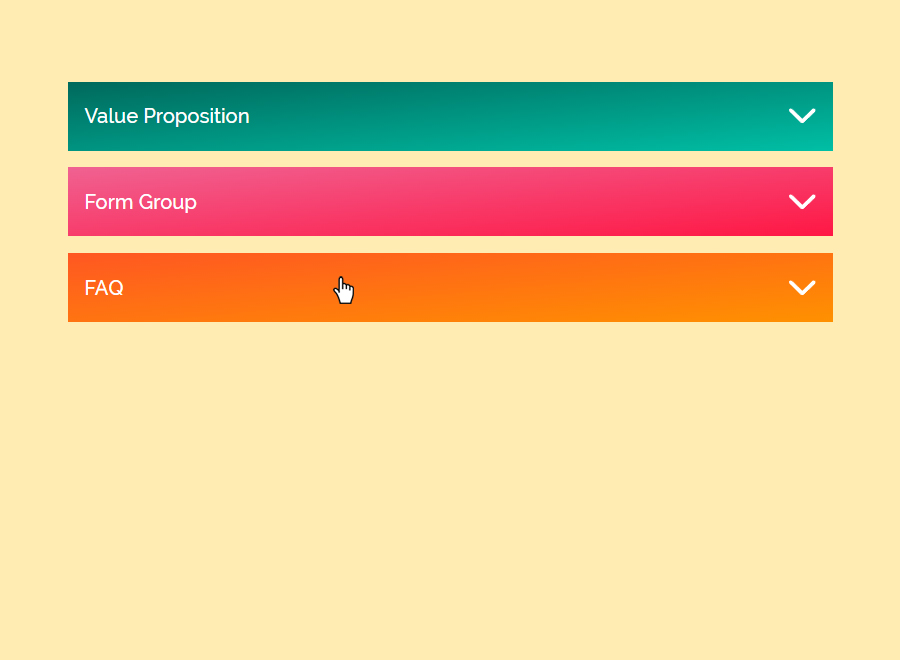

# Accordion Component

#### Aug 20 2022

This is a small project I created within this month, August 2022. I first designed this using Adobe XD around the first week, then I build it with HTML, SASS and JavaScript. This is some sort of an Accordion Component, though it has become quiet different. The references I see in my Google Search usually consist of having an element with max-height in CSS set to zero then with JavaScript, we modify it to a certain value so that the hidden element will be displayed, most of the element hidden consist of paragraphs. However, I imagined something different, where the element hidden in this Accordion project consist of some parts of a website. As you can see, there's Value Proposition, Form Group and FAQ as an example.

Instead of using max-height, I use margin-top with negative value, for example, margin-top: -50rem, this way, the element will be hidden. The parent element of this hidden element is set to overflow: hidden so that the element with the negative margin-top will not be visible.

With some test codes, I was able to pull it out.

To test this project to your own machine, install packages within 'package.json' one by one to avoid errors, then run 'npm run startDev' for development on your terminal.

### Screenshot
 

Live Site URL: [Live Demo](https://kennyestrella-accordion-component.netlify.app/)

### Used tools & technologies
    